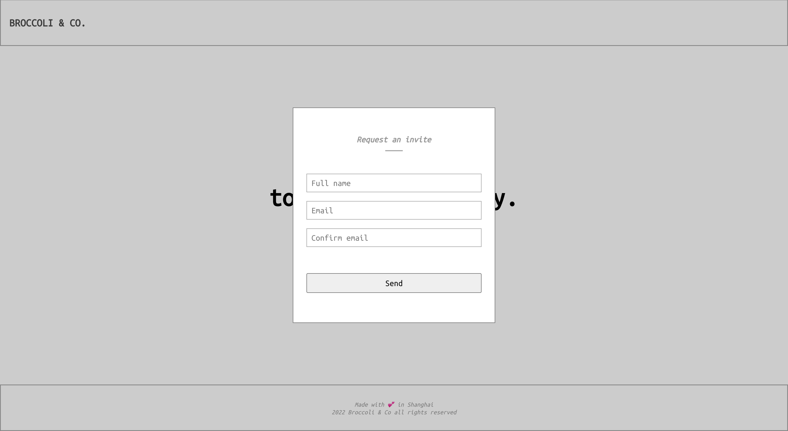

# airwallex-broccoli-and-co

Broccoli &amp; Co. delivers the freshest broccoli in the world to you

## To setup

Run `git clone https://github.com/shawncxc/airwallex-broccoli-and-co.git` to clone the repo.\
Go inside the cloned repo and run `npm install` to install all the dependencies.

## To run

Run `npm start`, the app will run in the development mode.\
Open [http://localhost:3000](http://localhost:3000) to view it in your browser.

## To build

Run `npm run build` and it builds the app for production to the `build` folder.
